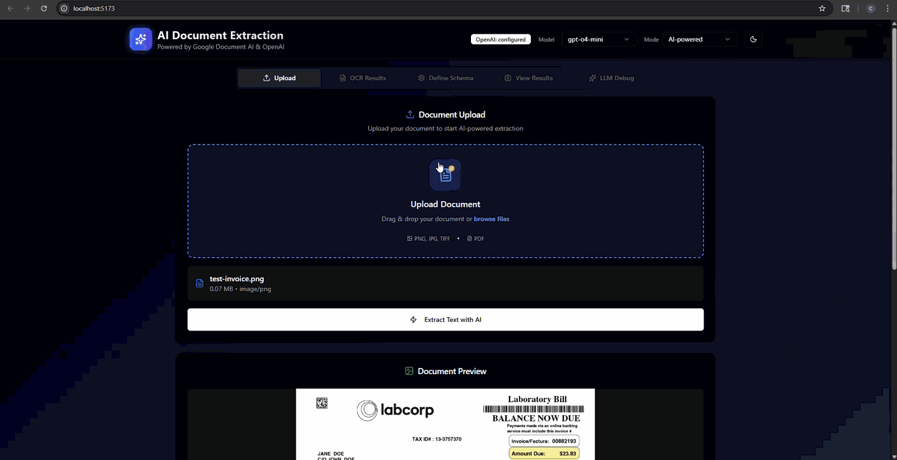
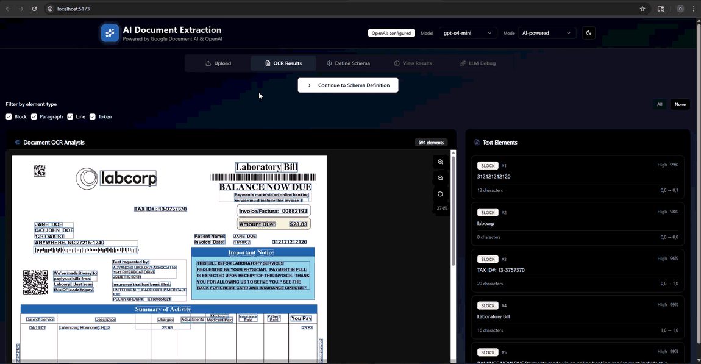
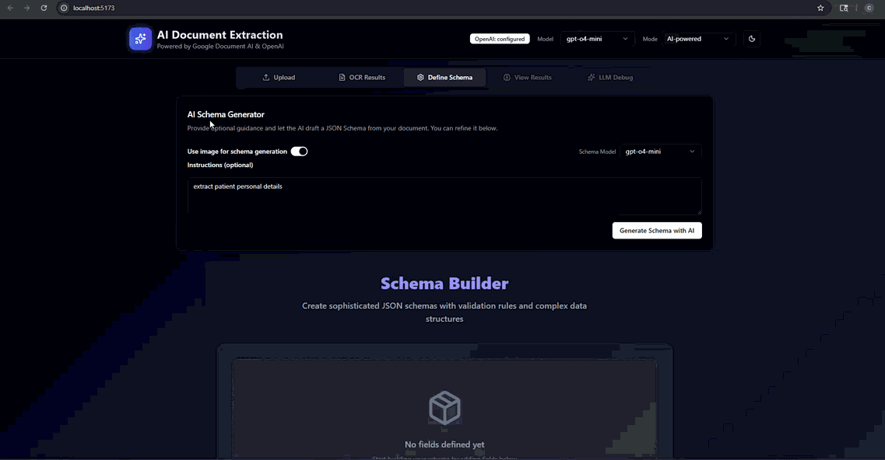

<p align="center"> 
   </img>
</p>

<h1>📄 DocuMind: Intelligent Document Data Extraction</h1>
<h3 align="center"> AI-powered document processing with custom schema support and visual grounding</h3>

<p align="center">
    <a href="https://reactjs.org/"></a>
    <a href="https://www.typescriptlang.org/"></a>
    <a href="https://tailwindcss.com/"></a>
    <a href="https://fastapi.tiangolo.com/"></a>
    <a href="https://www.python.org/"></a>
    <a href="https://cloud.google.com/document-ai"></a>
    <a href="https://platform.openai.com/"></a>
</p>

---

# ▶️ Demo

## Document Upload & OCR Processing




- **Drag & Drop Interface**: Upload documents (PDF, PNG, JPG, TIFF) through an intuitive drag-and-drop interface
- **Real-time Processing**: Documents are processed instantly using Google Document AI with quality assessment
- **Visual Feedback**: Progress indicators show OCR processing status and completion

## Interactive Document Visualization



- **Bounding Box Overlay**: View OCR results with color-coded bounding boxes for blocks, paragraphs, lines, and tokens
- **Hover Interactions**: Hover over bounding boxes to preview text content and confidence scores
- **Element Filtering**: Toggle visibility of different text elements (blocks, paragraphs, lines, tokens)
- **Click Selection**: Click bounding boxes to highlight corresponding text in the results panel

## Custom Schema Generation & Builder




- **Auto Schema Generation**: AI automatically generates JSON schemas from document samples (based on optional provided instructions)
- **Interactive Schema Builder**: Design custom schemas with drag-and-drop field creation
- **Field Types**: String, number, boolean, array, and nested object fields with validation
- **Additional Instructions**: Can add additional instructions in the prompt box to guide the extraction process

## Results Dashboard


- **Extracted Fields Display**: View all extracted fields with confidence scores, values, and source text blocks
- **Bounding Box Highlights**: Visual mapping shows exactly where each field was found in the document
- **Reasoning Tooltips**: LLM explanations for how each field was identified and extracted
- **Quality Metrics**: Processing time, confidence averages, schema validation status, and quality grades

## LLM Debug Section


- **Complete Prompts View**: Inspect the exact system and user prompts sent to the LLM, including all instructions and context
- **Multi-Stage Prompt Display**: For hybrid extraction mode, view Stage 1 and Stage 2 prompts separately in organized tabs
- **Raw LLM Response**: See the exact JSON response from the AI model before any backend post-processing or validation
- **Stage-Separated Responses**: In hybrid mode, view raw responses from both Stage 1 (initial extraction) and Stage 2 (grounding) in separate tabs

### Multi-Mode Extraction

Three extraction modes optimized for different needs:

- **Visual Grounding**: LLM receives image + all OCR blocks (with coordinates) → directly identifies source blocks (highest accuracy, highest cost)
- **Text-Only (Manual Grounding)**: LLM receives full OCR text + image (no OCR blocks) → backend matches extracted values to OCR blocks (60-70% cost savings, lower accuracy)
- **Hybrid RAG**: Stage 1: text + image extraction → Stage 2: filtered OCR blocks only (no image) → LLM grounds fields (60-80% token reduction, higher accuracy)

---

# 🖥️ Installation & Setup ⚙️

### Prerequisites

- Python 3.11+ ([Download](https://www.python.org/downloads/))
- Node.js 18+ and npm ([Download](https://nodejs.org/))
- Google Cloud Platform account ([Sign up](https://cloud.google.com/))
- OpenAI API access: [OpenAI Platform](https://platform.openai.com/)

---

## 📝 Step 1: Clone the Repository

```bash
git clone <repo_link>
cd Data_Extraction
```

---

## ☁️ Step 2: Set Up Google Document AI

Follow the official setup guide: [Google Document AI Quickstart](https://cloud.google.com/document-ai/docs/setup)

**What you'll need:**
- Google Cloud Project with Document AI API enabled
- Document AI Processor ID
- Service account JSON credentials file

Save the credentials file as `config/gcp-credentials.json` in your project.

---

## 🤖 Step 3: Set Up OpenAI

1. Get your API key from [OpenAI Platform](https://platform.openai.com/api-keys)
2. No endpoint or deployment name needed for direct API

---

## 🔧 Step 4: Configure Environment Variables

The project includes a template file with all available configuration options. Use it as a starting point:

```bash
# Copy the template file to create your .env file
cp config/env.template config/.env

# Or copy to project root (both locations work)
cp config/env.template .env
```

**The template file is located at:** `config/env.template`

Open the `.env` file you just created and fill in your actual values. The template includes:

### Required Configuration

1. **Google Document AI** (for OCR):
   ```bash
   GOOGLE_APPLICATION_CREDENTIALS=config/gcp-credentials.json
   GOOGLE_CLOUD_PROJECT=your-project-id
   GOOGLE_DOCUMENT_AI_PROCESSOR_ID=your-processor-id
   GOOGLE_DOCUMENT_AI_LOCATION=us
   ```

2. **OpenAI** (for structured extraction):
   ```bash
   # API Key (required)
   OPENAI_API_KEY=your-api-key-here
   
   # Base URL and model (optional, defaults to api.openai.com/v1 and gpt-4o)
   # OPENAI_BASE_URL=https://api.openai.com/v1
   # OPENAI_MODEL=gpt-4o
   ```

### Optional Configuration

The template also includes optional settings for:
- Server configuration (host, port, log level)
- Image processing limits
- Model-specific overrides (for multiple models)

**Important Notes:**
- ✅ **Use the template**: Always start with `config/env.template` - it has all available options documented
- ✅ **For Direct OpenAI**: Set `OPENAI_BASE_URL` and `OPENAI_MODEL` (or leave defaults)
- ⚠️ **Never commit**: The `.env` file is gitignored - keep your secrets safe!

---

## 🐍 Step 5: Install Python Dependencies

```bash
# Option 1: Using pip
pip install -e .

# Option 2: Using uv (faster)
pip install uv
uv pip install -e .
```

---

## 🚀 Step 6: Start the Backend

```bash
# Start the FastAPI server
python -m src.api.main
```

You should see:
```
✅ OpenAI structured extraction initialized. Models: ['gpt-4o-mini'], default='gpt-4o-mini'
INFO:     Uvicorn running on http://0.0.0.0:8000 (Press CTRL+C to quit)
```

**Backend is now running at:** [http://localhost:8000](http://localhost:8000)

**API Documentation:** [http://localhost:8000/docs](http://localhost:8000/docs)

---

## 🎨 Step 7: Install Frontend Dependencies

Open a **new terminal** window:

```bash
cd src/frontend
npm install
```

---

## 🌐 Step 8: Start the Frontend

```bash
npm run dev
```

You should see:
```
VITE v7.0.4  ready in 500 ms

➜  Local:   http://localhost:3000/
➜  Network: use --host to expose
```

**Frontend is now running at:** [http://localhost:3000](http://localhost:3000)

---

## ✅ Step 9: Verify Installation

1. Open [http://localhost:3000](http://localhost:3000) in your browser
2. You should see the Document OCR interface
3. Try uploading a test image (invoice, receipt, or any document)
4. If everything works, you'll see OCR results with bounding boxes!

---

# 📋 Key Features

- **Custom Schema Generation**: AI automatically generates JSON schemas from document samples - no manual schema design needed
- **Enterprise-Grade OCR**: Powered by Google Document AI with 99%+ accuracy on printed documents
- **Visual Grounding**: AI-powered field extraction with precise bounding box locations
- **Hybrid Extraction Pipeline**: Combines text-only extraction with semantic block filtering for optimal results
- **Image Quality Assessment**: Real-time quality scoring with defect detection and recommendations
- **Multi-Model Support**: Configure multiple OpenAI models (GPT-4o, GPT-4o-mini, GPT-4.5)
- **Interactive UI**: Modern React interface with real-time visualization and schema builder
- **RESTful API**: Well-documented FastAPI backend with OpenAPI/Swagger documentation
- **Type Safety**: Full TypeScript frontend and Pydantic backend for end-to-end type safety

---

# 🚀 Technical Details

## 💡 High-Level System Architecture

```
┌─────────────────────────────────────────────────────────────────────┐
│                         CLIENT LAYER                                 │
│  ┌──────────────────────────────────────────────────────────────┐  │
│  │  React Frontend (Port 3000)                                   │  │
│  │  • Document Upload UI                                         │  │
│  │  • Interactive Bounding Box Visualization                     │  │
│  │  • Schema Builder                                             │  │
│  │  • Results Dashboard                                          │  │
│  └──────────────────────────────────────────────────────────────┘  │
└─────────────────────────────────────────────────────────────────────┘
                                  │
                                  │ HTTP/REST API
                                  ▼
┌─────────────────────────────────────────────────────────────────────┐
│                      API GATEWAY LAYER                               │
│  ┌──────────────────────────────────────────────────────────────┐  │
│  │  FastAPI Backend (Port 8000)                                  │  │
│  │  • /ocr/upload - Document processing                          │  │
│  │  • /extract/structured - Visual grounding extraction          │  │
│  │  • /extract/structured/ocr-only - Text-only extraction        │  │
│  │  • /extract/structured/hybrid - Hybrid RAG pipeline           │  │
│  │  • /schema/generate - AI-powered custom schema generation     │  │
│  └──────────────────────────────────────────────────────────────┘  │
└─────────────────────────────────────────────────────────────────────┘
                    │                             │
                    │                             │
        ┌───────────┴──────────┐     ┌───────────┴──────────┐
        ▼                      ▼     ▼                      ▼
┌─────────────────┐  ┌─────────────────────────────────────────────┐
│  GOOGLE CLOUD   │  │         OPENAI API                        │
│  DOCUMENT AI    │  │  ┌─────────────────────────────────────┐   │
│                 │  │  │  GPT Models         │   │
│  • OCR Engine   │  │  │  • Structured Extraction             │   │
│  • Layout Parse │  │  │  • Visual Grounding                  │   │
│  • Quality Score│  │  │  • Schema Generation                 │   │
│  • Bounding Box │  │  │  • Reasoning & Confidence            │   │
│                 │  │  └─────────────────────────────────────┘   │
└─────────────────┘  └─────────────────────────────────────────────┘
        │                              │
        │                              │
        └──────────────┬───────────────┘
                       ▼
┌─────────────────────────────────────────────────────────────────────┐
│                    PROCESSING LAYER                                  │
│  ┌──────────────────────────────────────────────────────────────┐  │
│  │  Core Services                                                │  │
│  │  • DocumentOCRProcessor - OCR orchestration                   │  │
│  │  • VisuallyGroundedExtractor - AI extraction with grounding   │  │
│  │  • HybridGroundingService - RAG-style 2-stage pipeline        │  │
│  │  • ImageQualityAssessment - Quality scoring & defects         │  │
│  │  • SchemaValidator - JSON schema validation                   │  │
│  │  • ManualVisualGrounder - Backend text-to-block mapping       │  │
│  └──────────────────────────────────────────────────────────────┘  │
└─────────────────────────────────────────────────────────────────────┘
```

## 🔄 Extraction Pipeline Modes

### 1. Visual Grounding Mode
```
Document Image → Google OCR → OpenAI (Image + Structured OCR Blocks)
                                    ↓
                        LLM returns field_mappings with block IDs
                                    ↓
                        Extracted Data + Bounding Boxes
```
**LLM receives**: Image + structured OCR blocks (block_id, text, confidence, bounding_box coordinates)  
**LLM returns**: extracted_data + field_mappings (field → source_block_id)  
**Accuracy**: Highest - LLM directly identifies source blocks using visual understanding  
**Cost**: Highest - image tokens + full OCR block data

### 2. Text-Only Mode (Manual Grounding)
```
Document Image → Google OCR → OpenAI (Full Text + Image, no ocr blocks)
                                    ↓
                        LLM returns extracted_data (no field_mappings)
                                    ↓
                    Backend Manual Grounding Service
                    (fuzzy string matching to OCR blocks)
                                    ↓
                        Extracted Data + Bounding Boxes
```
**LLM receives**: Full OCR text (plain string) + image (no structured block data)  
**LLM returns**: extracted_data + reasoning_map (no field_mappings)  
**Backend**: Matches extracted values to OCR blocks using lexical/fuzzy matching  
**Cost savings**: 60-70% - no structured OCR blocks in prompt, reduces tokens significantly

### 3. Hybrid RAG Mode
```
Document Image → Google OCR
                    ↓
        Stage 1: OpenAI (Full Text + Image) → extracted_data + reasoning_map
                    ↓
        Stage 2: Semantic Block Filtering → top-K relevant blocks
                    ↓
        Stage 2: OpenAI (Full Text + Filtered Blocks, no image) → field_mappings
                    ↓
                        Extracted Data + Bounding Boxes
```
**Stage 1 LLM receives**: Full OCR text + image (same as Text-Only mode)  
**Stage 1 LLM returns**: extracted_data + reasoning_map  
**Block filtering**: Semantic + lexical matching identifies relevant OCR blocks  
**Stage 2 LLM receives**: Full text + filtered structured blocks (no image)  
**Stage 2 LLM returns**: field_mappings (field → source_block_id)  
**Cost savings**: 60-80% token reduction vs Visual Grounding (no image in stage 2, filtered blocks only)

---

# 🏗️ API Endpoints

| Endpoint | Method | Description |
|----------|--------|-------------|
| `/health` | GET | Health check with service status |
| `/ocr/upload` | POST | Upload file for OCR processing |
| `/ocr/base64` | POST | Process base64-encoded image |
| `/extract/structured` | POST | Visual grounding extraction (image + OCR) |
| `/extract/structured/ocr-only` | POST | Text-only extraction with backend grounding |
| `/extract/structured/hybrid` | POST | Hybrid RAG pipeline (2-stage) |
| `/schema/validate` | POST | Validate JSON schema |
| `/schema/generate` | POST | Auto-generate schema from document |
| `/docs` | GET | Interactive API documentation (Swagger) |

---

# 🎟️ License

This project is licensed under the Apache License 2.0 - see the [LICENSE](LICENSE) file for details.

---

# 📜 References & Acknowledgements

1. **Google Cloud Document AI**  
   Enterprise-grade document processing with OCR, layout understanding, and quality assessment.  
   [Documentation](https://cloud.google.com/document-ai/docs)

2. **OpenAI API**  
   GPT-4o models with structured outputs and visual understanding capabilities.  
   [Documentation](https://platform.openai.com/docs)

3. **FastAPI Framework**  
   Modern, fast web framework for building APIs with Python 3.11+ type hints.  
   [Documentation](https://fastapi.tiangolo.com/)

4. **shadcn/ui Component Library**  
   Beautifully designed accessible components built with Radix UI and Tailwind CSS.  
   [Documentation](https://ui.shadcn.com/)

5. **RAG (Retrieval-Augmented Generation)**  
   Hybrid extraction approach inspired by RAG patterns for optimal accuracy and efficiency.  
   [Paper](https://arxiv.org/abs/2005.11401)

6. **Structured Extraction with LLMs**  
   Best practices for extracting structured data from documents using vision-language models.  
   [OpenAI Documentation](https://platform.openai.com/docs/guides/structured-outputs)

7. **Cursor IDE**  
   AI-powered code editor that accelerates development with intelligent code completion and assistance.  
   [Documentation](https://cursor.sh/) | [Website](https://cursor.sh/)

